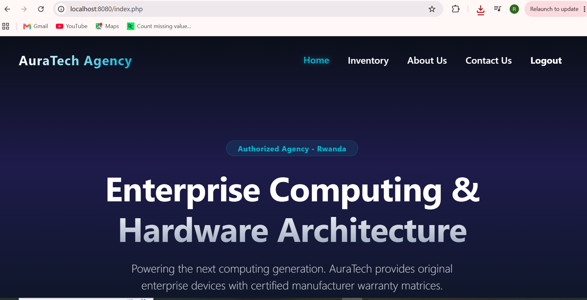
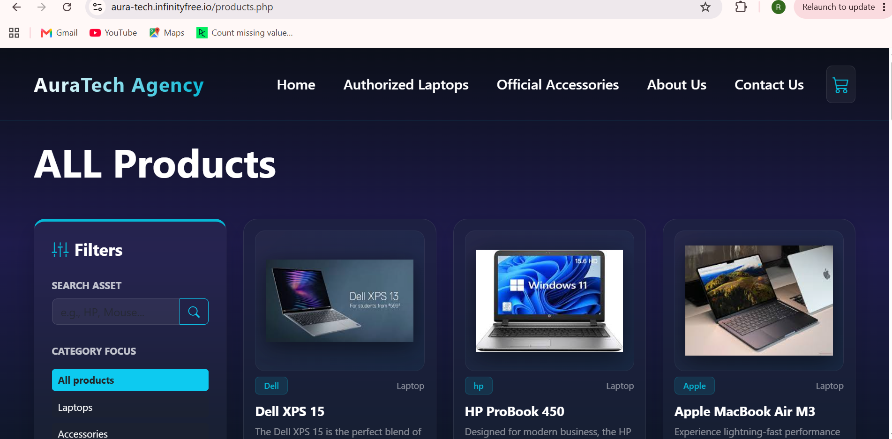
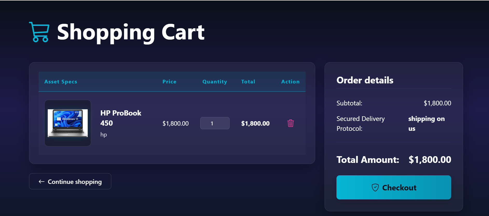
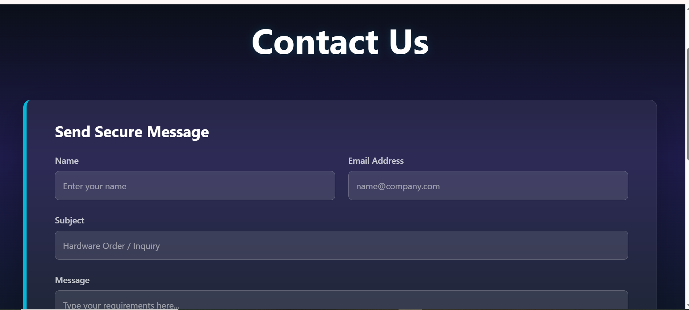
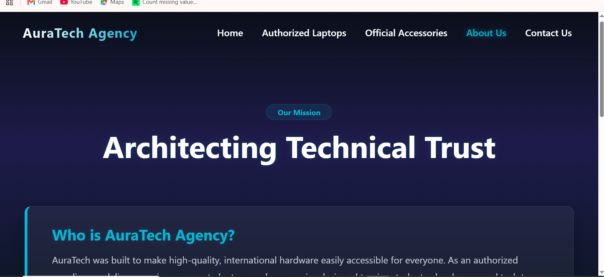
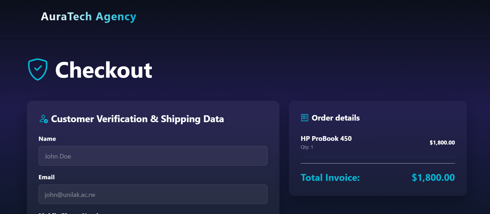
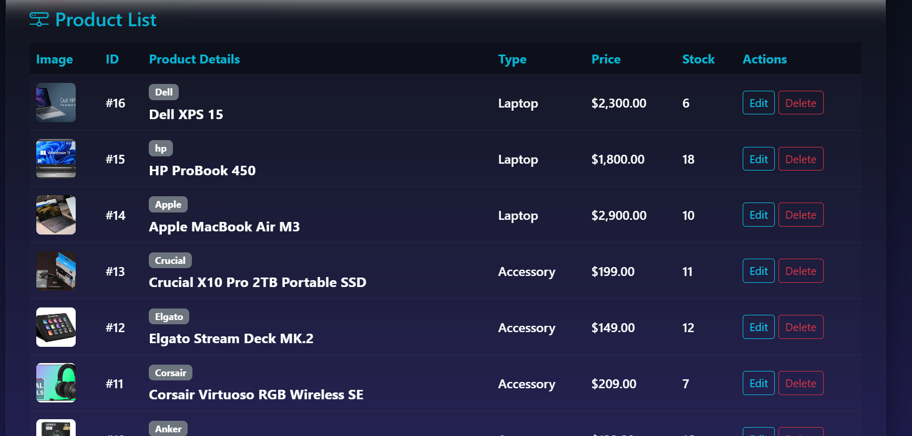
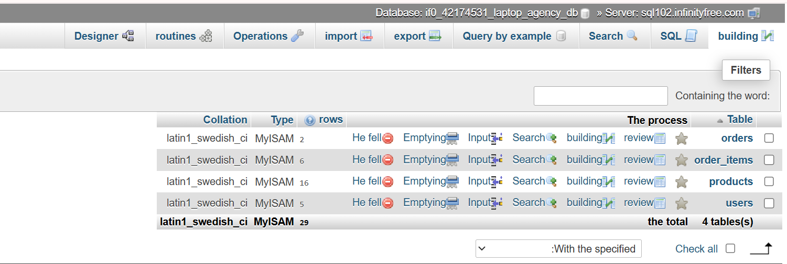
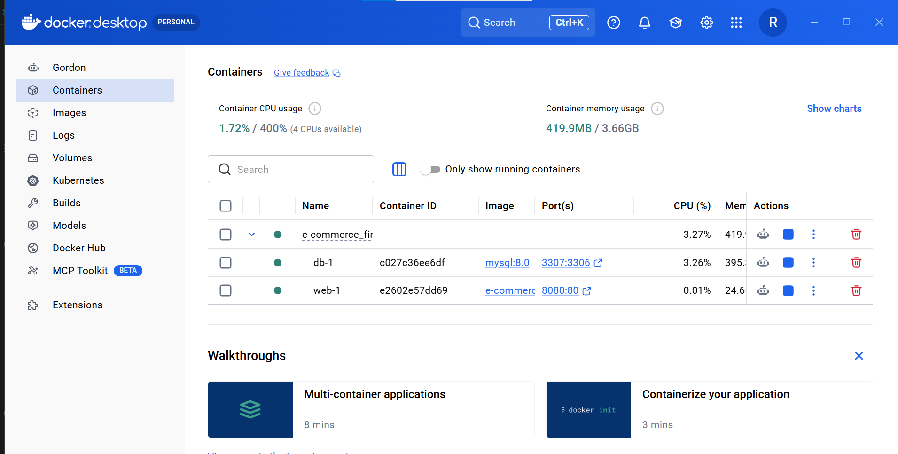
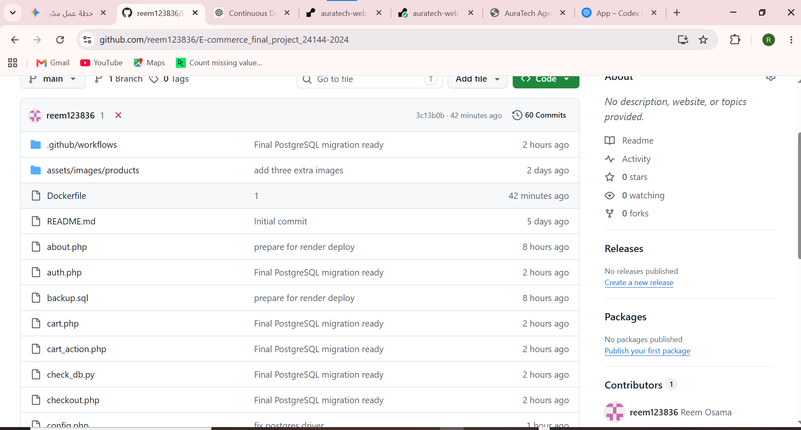

# AuraTech Agency

## Student Information

- **Name:** Reem Osama
- **Reg:** 24144-2024
- **Course:** E-commerce and Web Application 
- **Project Title:** AuraTech Agency


## Project Overview

AuraTech Agency is  a web-based inventory and product management system developed for a technology agency specializing in laptops and accessories.

The system provides administrators with a centralized dashboard to manage products, track inventory, update product information, and maintain accurate records efficiently.

The project was developed using PHP, MySQL, Docker, GitHub, GitHub Actions, and InfinityFree Hosting.


## Problem Statement

Many small businesses and technology agencies face challenges when managing inventory manually. These challenges include:

- Inaccurate stock tracking
- Product information inconsistencies
- Pricing errors
- Inefficient workflows
- Limited visibility of inventory status

AuraTech Management System addresses these issues by providing a centralized digital platform that automates inventory management and improves operational efficiency.


## Objectives

The objectives of this project are:

- Develop a responsive inventory management system.
- Maintain accurate inventory records.
- Improve administrative efficiency.
- Deploy the system online.
- ​Create a reliable system that updates automatically.
- Add smart tools like search, filtering, and payment selection.

## Features

### Product Dashboard

Displays all products in a structured table.

### Add Product

Allows administrators to add new products.

### Edit Product

Allows administrators to update:

- Product Name
- Brand
- Description
- Price
- Stock Quantity
- Product Image

### Delete Product

Allows administrators to remove products from inventory.

### Inventory Tracking

Provides real-time stock management.

### Session Notifications

Displays success and error messages after operations.


## Technologies Used

### Frontend

- HTML5
- CSS3

### Backend

- PHP

### Database

- MySQL

### Development Environment

- Docker (Used for local containerization to ensure consistency).

### Deployment Tools

- InfinityFree(FTP-based).
- GitHub Actions


## System Architecture

The system follows a Client-Server Architecture.

### Client Layer

Users interact with the system through a web browser.

### Application Layer

PHP handles:

- Business logic
- Form validation
- CRUD operations
- Database communication

### Database Layer

MySQL stores:

- Product information
- Inventory data
- Product images
- Product descriptions

### Deployment Layer

GitHub Actions automatically deploys updates to InfinityFree using FTP.


# Development Process

## Phase 1: Planning

The project started by identifying the requirements of an inventory management system for a technology agency.

The goal was to provide a centralized dashboard that simplifies product management and inventory tracking.


## Phase 2: Database Design

A MySQL database was designed to store product information including:

- Product ID
- Product Name
- Brand
- Description
- Price
- Stock Quantity
- Product Image


## Phase 3: Application Development

The backend was implemented using PHP.

CRUD functionality was developed to allow administrators to:

- Add products
- Edit products
- Delete products
- Manage inventory


## Phase 4: Local Deployment Using Docker

Docker was used during development to create a local testing environment.

### Docker Setup

The project included:

- PHP + Apache Container
- MySQL Container

Benefits of Docker:

- Consistent development environment
- Easy testing
- Faster setup
- Simplified database management


## Phase 5: Deployment Attempts Using Render

Initially, the project was deployed using Render.

Although the deployment process appeared successful, the application encountered multiple database connectivity issues.

Several solutions were attempted including:

- Creating PostgreSQL databases
- Migrating from MySQL to PostgreSQL
- Configuring DATABASE_URL
- Updating Docker configuration
- Recreating databases
- Redeploying multiple times

Despite these efforts, the application could not reliably communicate with the database.


## Phase 6: Final Deployment Using InfinityFree

After extensive troubleshooting, the project was migrated to InfinityFree Hosting.

### Deployment Process

1. Created hosting account on InfinityFree.
2. Created MySQL database.
3. Connected the project database.
4. Uploaded project files using FTP.
5. Connected GitHub repository.
6. Configured GitHub Actions for automated deployment.

This solution successfully deployed the application online.


## Appendix

### Figure 1: Home Page

The home page introduces AuraTech Management System.




###  Figure 2: Product inventory

Displays all products and inventory information.




### Figure 3: Cart

Customer can view the cart.




### Figure 4: Contact us

Customers can easily reach out to our support team or send inquiries through this dedicated contact form.




### Figure 5: About us

This page provides comprehensive information about our company, mission, and the administrators managing the platform.




### Figure 6: Checkout

This page allows customers to review their selected products, calculate the total cost, and finalize their order securely. It provides a seamless transition from cart to order completion.




### Figure 7: Administrators Dashboard

Administrators can update product information.




### Database Structure

MySQL database structure used in the project.




### Docker Environment

Local Docker development environment.




## CI/CD Workflow

The project implements both Continuous Integration (CI) and Continuous Deployment (CD) using GitHub and GitHub Actions.

### Continuous Integration (CI)

Continuous Integration was achieved through GitHub version control during the development process.

The CI process included:

1. Writing and testing code locally.
2. Tracking all changes using Git.
3. Committing updates to the GitHub repository.
4. Maintaining version history and project backups.
5. Reviewing and validating code before deployment.


### Continuous Deployment (CD)

Continuous Deployment was implemented using GitHub Actions and FTP deployment to InfinityFree hosting.

### Deployment Workflow

1. The developer makes changes locally.
2. The code is tested and verified.
3. Changes are committed using Git.
4. The updated code is pushed to the GitHub repository.
5. GitHub Actions automatically triggers the deployment workflow.
6. The FTP deployment process starts.
7. Project files are uploaded to the InfinityFree hosting server.
8. The live website is updated automatically.


## Challenges Encountered

### Challenge 1: Product Update Issue

#### Problem

Product images disappeared when updating product information.

#### Cause

The image path was being replaced with a default value during update operations.

#### Solution

The SQL update query was modified to preserve existing image references.

#### Result

Products can now be updated without losing images.


### Challenge 2: Render Database Issues

#### Problem

The application deployed successfully but could not communicate with the database.

#### Errors Encountered

```text
DATABASE_URL is not set
```

```text
could not find driver
```

```text
Foreign key violation

```
###  Figure :




#### Solution

Multiple deployment and database migration attempts were performed.

Eventually, InfinityFree hosting was selected as the final deployment platform.


### Challenge 3: GitHub Actions FTP Deployment

#### Problem

InfinityFree does not support Docker deployment or SSH access.

#### Solution

Configured GitHub Actions to perform automatic FTP deployment.

#### Result

Every push to GitHub automatically updates the live website.


## Lessons Learned

Through this project I learned:

- PHP web development
- MySQL database management
- CRUD implementation
- Docker containerization
- Git and GitHub workflows
- GitHub Actions automation
- FTP deployment
- Cloud hosting
- Database migration
- Deployment troubleshooting


## Future Improvements

Future enhancements may include:

- Live Payment Gateway Integration: Moving from a manual payment selection method to a fully integrated API (e.g., Stripe or PayPal) to allow real-time online transaction processing.
- Barcode & QR Scanner Integration: Adding functionality to scan product barcodes using a camera or external scanner for faster inventory updates and searching.
- Custom Notification System: Sending automated email or SMS notifications to the admin when product stock levels fall below a specific threshold.
- Advanced Multi-Language Support: Adding the ability to switch the dashboard interface between different languages (e.g., Arabic, English, Kinyarwanda) to make the tool accessible to a wider range of users.


## Live Website

[Click here to visit the live AuraTech website](https://aura-tech.infinityfree.io/auth.php)


## GitHub Repository

[Check out the source code on GitHub](https://github.com/reem123836/E-commerce_final_project_24144-2024)


## Conclusion

AuraTech Management System successfully provides a centralized solution for managing products and inventory operations.

The project demonstrates practical implementation of PHP, MySQL, Docker, GitHub, GitHub Actions, and cloud hosting technologies.

The development process included several technical challenges, particularly in deployment and database configuration. Solving these issues provided valuable real-world experience in software development, deployment automation, debugging, and troubleshooting.

The final system delivers a functional, responsive, and maintainable inventory management system.